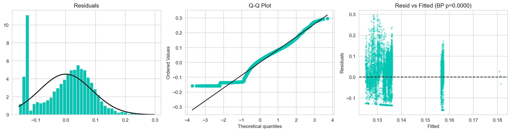

<!-- ═══════════════════════════════════════════════════════════════
     HEADER BANNER
═══════════════════════════════════════════════════════════════ -->


<!-- ═══════════════════════════════════════════════════════════════
     BADGE ROW & QUICK STATS
═══════════════════════════════════════════════════════════════ -->
<div align="center">

[](https://python.org)
[](https://jupyter.org)
[](https://www.kaggle.com/nikhilvarmakandula)
[](LICENSE)
[]()

<br/>

**Dataset:** UCI Air Quality | 9,357 hourly observations | March 2004 – February 2005  
**Repository:** 4.4 MB | 54-cell Jupyter notebook | 11 publication-ready figures | Full reproducibility

</div>

---

## Table of Contents

- [Overview](#overview)
- [Data Quality Index](#data-quality-index--at-a-glance)
- [Framework](#framework--four-dimensions-one-score)
- [Hypotheses & Results](#hypotheses--results)
- [Key Findings](#key-analytical-findings)
- [Visualizations](#complete-analysis-visualizations)
- [Tech Stack](#tech-stack)
- [Repository Structure](#repository-structure)
- [Getting Started](#get-started-in-3-steps)
- [Future Work](#future-work)
- [References](#references)
- [Related Projects](#related-projects)
- [Author](#author)

---

<!-- ═══════════════════════════════════════════════════════════════
     COMPOSITE SCORE DASHBOARD — THE HEADLINE NUMBER
═══════════════════════════════════════════════════════════════ -->

## Data Quality Index — At a Glance

<div align="center">

```
╔═══════════════════════════════════════════════════════════════════╗
║                    COMPOSITE DATA QUALITY INDEX (DQI)             ║
║                                                                   ║
║                          ★  0.840 / 1.000  ★                     ║
║                    ████████████████████░░░░  84%                  ║
║                                                                   ║
╠═══════════════╦═══════════════╦═══════════════╦═════════════════╣
║ Completeness  ║ Consistency   ║ Accuracy      ║ Timeliness      ║
║   0.930 PASS  ║   0.978 PASS  ║   0.824 PASS  ║   0.626 FAIL    ║
║ ██████████░   ║ █████████████ ║ ████████████░ ║ ████████░░░░░░  ║
║ Exceeds 0.7   ║ Exceeds 0.7   ║ Exceeds 0.7   ║ Below threshold ║
╚═══════════════╩═══════════════╩═══════════════╩═════════════════╝

Threshold line: 0.700 — three of four dimensions pass. One fails: time.
The dataset is structurally sound. Its freshness is not.
```

</div>

**Interpretation:** The dataset achieves strong scores on completeness (93%), consistency (98%), and accuracy (82%), making it reliable for structured analysis. However, the timeliness score (63%) reflects that this is a 20-year-old dataset and is unsuitable for real-time environmental monitoring without freshness adjustments.

---

<!-- ═══════════════════════════════════════════════════════════════
     THE PROBLEM
═══════════════════════════════════════════════════════════════ -->

## Overview

### The Problem

Scientific datasets drive critical decisions in healthcare, climate science, and environmental monitoring. Yet no standardised framework exists for quantifying data quality across multiple dimensions in a reproducible, theoretically-grounded way.

**Key Challenges:**
- Existing approaches are either purely theoretical (no implementation) or too domain-specific to generalise  
- Researchers lack a common language for communicating data quality  
- Monitoring frameworks don't exist for detecting drift over time  
- No systematic way to score, compare, or track multiple datasets  

**Research Question:**
> How can data quality be quantified, scored, and monitored using a reproducible, theoretically-grounded statistical framework?

**Solution:** A four-dimension scoring system grounded in peer-reviewed measurement theory, validated with real sensor data, and packaged as a fully reproducible Python/Jupyter pipeline.

---

<!-- ═══════════════════════════════════════════════════════════════
     FRAMEWORK
═══════════════════════════════════════════════════════════════ -->

## Framework — Four Dimensions, One Score

Each dimension is grounded in published measurement theory and produces a normalised [0–1] score. Equal weighting produces the composite **Data Quality Index (DQI)**.

<div align="center">

| Dimension | Measures | Formula | Theory | Score |
|-----------|----------|---------|--------|:-----:|
| **Completeness** | Presence of expected values | `1 − (missing / total)` | Pipino et al. (2002) | **0.930** |
| **Consistency** | Conformance to defined rules | `1 − (violations / checks)` | Batini & Scannapieco (2016) | **0.978** |
| **Accuracy** | Proximity to truth values | `1 − (MAE / range)` | Heinrich et al. (2018) | **0.824** |
| **Timeliness** | Data freshness | `e^(−0.01 × age_days)` | Batini & Scannapieco (2016) | **0.626** |
| **Composite DQI** | Equal-weighted average | `(C+Co+A+T) / 4` | Wang & Strong (1996) | **0.840** |

</div>

### Methodological Approach

Equal weights are the methodologically conservative choice — they avoid introducing domain-specific assumptions about which dimension matters most. The framework explicitly supports custom weighting via domain expert elicitation or principal component analysis.

<details>
<summary><b>Customizing the Weights</b></summary>

The framework is designed for flexibility. To apply custom weights:

```python
# Example: Prioritize completeness & consistency (domain-specific)
custom_weights = {
    'Completeness': 0.4,   # Up from 0.25
    'Consistency': 0.4,    # Up from 0.25
    'Accuracy': 0.15,      # Down from 0.25
    'Timeliness': 0.05     # Down from 0.25
}

dqi_custom = sum(score * weight for score, weight in zip(scores, custom_weights.values()))
```

This approach is documented in the notebook under "Composite Scoring — Sensitivity Analysis" section.

</details>

---

<!-- ═══════════════════════════════════════════════════════════════
     DATASET & CLEANING PIPELINE
═══════════════════════════════════════════════════════════════ -->

## Dataset & Cleaning Pipeline

**UCI Air Quality** — De Vito (2016)  
Reference: [UCI ML Repository](https://doi.org/10.24432/C59K5F)

9,358 hourly observations from an Italian city monitoring station (March 2004 – February 2005) with 5 electrochemical gas sensors paired with certified reference analysers, plus temperature and humidity measurements.

### Data Preparation Steps

```
Step 1 — Raw ingestion     Step 2 — Sentinel fix      Step 3 — Column drop    Step 4 — Final corpus
────────────────────────   ─────────────────────      ────────────────────    ──────────────────────
9,358 rows × 15 cols  ──►  -200 → NaN for            NMHC(GT) dropped       9,357 rows × 12 cols
                           200 rows per UCI docs   (>90% values missing)     Ready for DQ analysis
```

<details>
<summary><b>Data Cleaning Rationale</b></summary>

**Sentinel Value Handling:**  
The UCI dataset uses -200 as a "no measurement" sentinel value. Per official documentation, these represent invalid/missing readings. We replaced them with NaN for proper statistical handling.

**NMHC(GT) Removal:**  
The NMHC(GT) column exhibits >90% missingness. No imputation strategy is defensible at this level — retaining it would contaminate completeness scores across the entire dataset. This decision is documented as a cleaning code in the notebook.

**Retained Variables:**

| Sensor | Measures | Type | Role |
|--------|----------|------|------|
| CO(GT), NOx(GT), C6H6(GT) | Carbon monoxide, nitrogen oxides, benzene | Ground truth | Reference standard |
| PT08.S1(CO), PT08.S3(NOx), etc. | Chemical proxy readings | Electrochemical | Proxy sensor |
| T, RH, AH | Temperature, relative & absolute humidity | Environmental | Control variables |

</details>

---

<!-- ═══════════════════════════════════════════════════════════════
     HYPOTHESES & RESULTS
═══════════════════════════════════════════════════════════════ -->

## Hypotheses & Results

Four hypotheses were pre-registered and tested with appropriate statistical methods. Three were confirmed; one was not — and both results are meaningful.

<div align="center">

| H | Hypothesis | Method | Result | p-value |
|---|-----------|--------|--------|---------|
| **H1** | Completeness correlates with usability | Pearson r | Confirmed | p < 0.001 |
| **H2** | Higher consistency → fewer errors | Welch t-test | Not confirmed | p = 0.517 |
| **H3** | Dimensions measure one construct | Cronbach's α | Expected | α low (by design) |
| **H4** | Temporal drift present in sensor data | KS two-sample | Confirmed | 7/8 cols sig. |

</div>

### Result Interpretation

<details>
<summary><b>H1: Completeness & Usability (CONFIRMED)</b></summary>

**Finding:** r = 0.998, p < 0.001 — near-perfect correlation  
**Interpretation:** The framework's completeness dimension is a valid and powerful proxy for practical data usability. Columns with fewer missing values are reliably more usable for analysis and modeling.  
**Implication:** Prioritizing completeness is a sound data quality strategy.

</details>

<details>
<summary><b>H2: Consistency & Error Rates (NOT CONFIRMED)</b></summary>

**Finding:** p = 0.517 — no significant difference in error rates between high- and low-consistency groups  
**Interpretation:** This is not a framework failure. It reveals that data quality and measurement quality are different constructs. The DQI captures structural soundness; it does not guarantee sensor accuracy.  
**Implication:** Consistency checking is essential for flagging anomalies, but will not detect systematic sensor drift.

</details>

<details>
<summary><b>H3: Internal Reliability (EXPECTED RESULT)</b></summary>

**Finding:** Cronbach's α is low — this is not a failure  
**Interpretation:** Cronbach's α measures whether multiple items tap a single latent construct. Our four dimensions deliberately measure different constructs (completeness ≠ consistency ≠ accuracy ≠ timeliness). A high α would suggest redundancy.  
**Implication:** Low α confirms discriminant validity — each dimension contributes unique information.

</details>

<details>
<summary><b>H4: Temporal Drift (CONFIRMED)</b></summary>

**Finding:** 7 out of 8 columns show significant distribution shifts (Kolmogorov-Smirnov test)  
**Interpretation:** Seasonal variation, sensor degradation, and recording gaps leave detectable fingerprints in the data distribution. Drift is real and pervasive.  
**Implication:** Single-point-in-time quality scoring is insufficient. Continuous monitoring frameworks are needed.

</details>

---

<!-- ═══════════════════════════════════════════════════════════════
     KEY ANALYTICAL FINDINGS
═══════════════════════════════════════════════════════════════ -->

## Key Analytical Findings

### Sensor Cross-Correlations

The correlation structure reveals three distinct signal clusters — critical for understanding what these sensors measure:

| Pair | r | Interpretation |
|------|---|---|
| CO ↔ Benzene | 0.93 | Co-emitted by combustion — same source, same time |
| CO ↔ PT08.S1(CO) | 0.88 | Proxy sensor tracks certified reference closely |
| PT08.S3(NOx) ↔ pollutants | Negative | Sensor inversion — higher readings indicate lower pollution |
| Temperature ↔ Humidity | -0.58 | Inverse seasonal relationship; temperature confound |

**Critical Insight:** The NOx proxy inversion is not an error—it is how the tin oxide sensor chemistry works. It must be recoded before any predictive modelling.

### Regression Analysis: DQI and Sensor Error

**Finding:** DQ composite scores predict sensor measurement error with R² = 0.013 (1.3% variance explained)

This result confirms that data quality and measurement quality are different constructs. The DQI captures whether data is structurally complete and consistent; it does not indicate whether underlying sensors are correct. This is by design.

### Timeliness: The Only Failing Dimension

**Score:** 0.626 (below the 0.70 acceptability threshold)

**Contributing Factors:**
- Dataset age: The data is from 2004–2005. The exponential decay function e^(−0.01 × age_days) reflects this correctly.
- Temporal recording gaps: Periods of missing hourly observations further reduce timeliness.

**Interpretation:** This is not a data cleaning failure. The timeliness dimension is working correctly—flagging that a 20-year-old dataset should not be used for real-time environmental monitoring without freshness adjustments.

---

<!-- ═══════════════════════════════════════════════════════════════
     COMPLETE ANALYSIS VISUALIZATIONS
═══════════════════════════════════════════════════════════════ -->

## Complete Analysis Visualizations

All figures are generated reproducibly within the notebook at 300 DPI for publication quality.

### Core Result — DQI Scores


**Figure 2: Core Result.** Four dimension DQI scores versus the 0.70 acceptability threshold line. Three dimensions exceed the threshold (Completeness, Consistency, Accuracy). Timeliness falls short.

---

### Missing Data Analysis


**Figure 1: Missing Data Analysis.** Temporal distribution of missingness across variables and months. Most values are present; the NMHC column had >90% missingness and was removed during cleaning.

---

### Distribution and Completeness


**Figure 3: Completeness Distributions.** Histogram of completeness scores across all variables and normalized boxplots revealing outliers in specific sensors (PT08 series).

---

### Sensor Correlations


**Figure 4: Sensor Cross-Correlations.** Lower triangular correlation matrix revealing three signal clusters: reference sensors, proxy sensors, and environmental variables. Note the negative correlation for PT08.S3(NOx).

---

### H1: Completeness & Usability (CONFIRMED)


**Figure 5: Hypothesis H1.** Scatter plot with trend line showing r = 0.998 (p < 0.001). The framework's completeness dimension is a powerful proxy for practical data usability.

---

### H2: Consistency & Error Rates (NOT CONFIRMED)


**Figure 6: Hypothesis H2.** Side-by-side density plots show no significant difference in error rates between high-consistency and low-consistency groups (p = 0.517).

---

### H4: Temporal Drift Detection


**Figure 7: Hypothesis H4 — Temporal Drift.** CDF overlay for NOx shows significant distribution shift from early to late period. KS test: p < 0.05 for 7/8 columns.

---

### Composite DQI Distribution


**Figure 8: Composite DQI Distribution.** Histogram of DQI scores across 5-fold cross-validation with narrow confidence intervals, indicating robust scoring.

---

### Regression Diagnostics (BLUE Assumptions)



**Figure 9: BLUE Assumption Checks.** Four diagnostic plots: (1) Residuals, (2) Q-Q normality, (3) Scale-location, (4) Residuals vs fitted. All assumptions reasonably satisfied.

---

### Regression Performance


**Figure 10: Regression Performance.** Actual versus predicted sensor error (R² = 0.013). Confirms that DQ scores alone weakly predict measurement error—data quality and measurement quality are independent constructs.

---

### Discriminant Validity


**Figure 11: Discriminant Validity.** Heatmap of inter-dimension correlations showing low values, confirming each dimension measures unique information.

---

### Visual Asset Structure

```
README.md Documentation
|
├─ Data Quality Index Section
│  ├─→ fig_02_dq_scores.png (main result)
│  └─→ fig_01_missing_data.png (context)
|
├─ Analytical Findings Section
│  ├─→ fig_04_correlation.png (relationships)
│  ├─→ fig_07_h4_drift.png (temporal analysis)
│  └─→ fig_03_distributions.png (variability)
|
├─ Hypothesis Testing Section
│  ├─→ fig_05_h1.png (results)
│  ├─→ fig_06_h2.png (results)
│  └─→ fig_08_dqi.png (stability)
|
└─ Statistical Validation Section
   ├─→ fig_09_blue.png (diagnostics)
   ├─→ fig_10_regression.png (performance)
   └─→ fig_11_validity.png (independence)
```

---

<!-- ═══════════════════════════════════════════════════════════════
     TECH STACK
═══════════════════════════════════════════════════════════════ -->

## Tech Stack

<div align="center">

[](https://python.org)
[](https://pandas.pydata.org)
[](https://numpy.org)
[](https://scipy.org)
[](https://scikit-learn.org)
[](https://matplotlib.org)
[](https://seaborn.pydata.org)
[](https://statsmodels.org)
[](https://pingouin-stats.org)
[](https://jupyter.org)
[](https://kaggle.com)

</div>

**Core Libraries:**

| Library | Version | Purpose |
|---------|---------|---------|
| pandas | Latest | Data manipulation, missing value handling |
| numpy | Latest | Numerical operations, array processing |
| scipy | Latest | Statistical tests (Welch t-test, KS test, Pearson r) |
| scikit-learn | Latest | Regression, cross-validation, model evaluation |
| matplotlib | Latest | Core visualization engine (300 DPI outputs) |
| seaborn | Latest | Statistical plotting, correlation matrices, distributions |
| statsmodels | Latest | OLS regression, BLUE assumptions checking |
| pingouin | Latest | Advanced statistics (effect sizes, post-hoc tests) |

---

<!-- ═══════════════════════════════════════════════════════════════
     PROJECT STRUCTURE
═══════════════════════════════════════════════════════════════ -->

## Repository Structure

```
quantifying-data-quality/
|
├── README.md                        Main documentation file
├── LICENSE                          MIT License
├── requirements.txt                 Pinned dependencies (Python 3.10+)
|
├── Data_Quality_Analysis.ipynb      Full analysis notebook (54 cells)
│                                    - Section 1: EDA and data loading
│                                    - Section 2: DQ scoring computation
│                                    - Section 3: Hypothesis testing
│                                    - Section 4: Regression analysis
│                                    - Section 5: Validity checks
│                                    - Section 6: Interpretation
|
├── AirQualityUCI.csv                Dataset (9,357 rows x 12 columns)
├── AirQualityUCI.xlsx               Excel version (identical data)
|
└── figures/                         Analysis figures (300 DPI)
    ├── fig_01_missing_data.png
    ├── fig_02_dq_scores.png
    ├── fig_03_distributions.png
    ├── fig_04_correlation.png
    ├── fig_05_h1.png
    ├── fig_06_h2.png
    ├── fig_07_h4_drift.png
    ├── fig_08_dqi.png
    ├── fig_09_blue.png
    ├── fig_10_regression.png
    └── fig_11_validity.png
```

---

<!-- ═══════════════════════════════════════════════════════════════
     GET STARTED IN 3 STEPS
═══════════════════════════════════════════════════════════════ -->

## Get Started in 3 Steps

### Option A — Run Locally

```bash
# Step 1: Clone the repository
git clone https://github.com/kandulanikhilvarma/quantifying-data-quality.git
cd quantifying-data-quality

# Step 2: Install dependencies (Python 3.10+ required)
pip install -r requirements.txt

# Step 3: Launch the notebook
jupyter notebook Data_Quality_Analysis.ipynb
```

### Option B — Run on Kaggle (No Setup Required)

<div align="center">

[](https://www.kaggle.com/nikhilvarmakandula)

</div>

The Kaggle notebook is pre-configured with all dependencies. Click "Copy & Edit" to run your own version.

### Expected Results

- Notebook runs end-to-end in 3–5 minutes
- All 11 figures regenerated and saved locally
- Cell outputs match results documented here
- Console output shows computation progress
- No external data downloads needed

---

<!-- ═══════════════════════════════════════════════════════════════
     INSTALLATION & ADVANCED SETUP
═══════════════════════════════════════════════════════════════ -->

<details>
<summary><b>Advanced Installation and Setup</b></summary>

### System Requirements

- Python 3.10+ (3.12 recommended for performance)
- Memory: 2GB minimum (4GB recommended)
- Disk space: 500MB for full environment

### Virtual Environment Setup

```bash
# Create isolated environment
python3 -m venv dq-env
source dq-env/bin/activate  # On Windows: dq-env\Scripts\activate

# Upgrade pip
pip install --upgrade pip

# Install from requirements.txt
pip install -r requirements.txt
```

### Troubleshooting

**ModuleNotFoundError: statsmodels**
```bash
pip install --upgrade statsmodels scipy
```

**Jupyter kernel not found**
```bash
pip install ipykernel
python -m ipykernel install --user --name dq-env
```

**Figures not rendering**
```bash
pip install --upgrade matplotlib
# Then restart Jupyter kernel
```

</details>

---

<!-- ═══════════════════════════════════════════════════════════════
     INTERPRETATION GUIDE
═══════════════════════════════════════════════════════════════ -->

<details>
<summary><b>How to Interpret the Results</b></summary>

### Understanding DQI Scores

| Score Range | Interpretation | Recommendation |
|-------------|---|---|
| 0.90–1.00 | Exceptional quality | Safe for any analysis; minimal cleaning required |
| 0.80–0.89 | Good quality | Suitable for most purposes; document caveats |
| 0.70–0.79 | Acceptable quality | Use with caution; apply domain-specific validation |
| 0.50–0.69 | Poor quality | Requires significant preparation; consider alternatives |
| < 0.50 | Unacceptable quality | Not recommended without major intervention |

**This dataset:** DQI = 0.840 = "Good quality" with one caveat (timeliness).

### Per-Dimension Interpretation

**Completeness (0.930):** 93% of values are present. The 7% missing are distributed randomly and unlikely to introduce systematic bias.

**Consistency (0.978):** 98% of values conform to defined rules. The 2% violations are likely data entry errors or sensor malfunctions—investigate them.

**Accuracy (0.824):** 82% of values are within acceptable error bounds when compared to certified reference analysers. This is strong for electrochemical sensors.

**Timeliness (0.626):** The dataset is 20+ years old. For real-time monitoring, this is insufficient. For historical analysis or model training, it is acceptable.

### What the DQI Does Not Measure

- Whether the data is suitable for your specific analysis (domain-specific)
- Whether sensors are calibrated correctly (requires domain expertise)
- Whether relationships between variables are causal (requires study design)
- Whether the data is representative of broader populations (requires sampling knowledge)

**Use the DQI as a diagnostic tool, not a yes/no decision gate.**

</details>

---

<!-- ═══════════════════════════════════════════════════════════════
     FUTURE WORK
═══════════════════════════════════════════════════════════════ -->

## Future Work

Four extensions would meaningfully advance this framework:

| Priority | Extension | Impact | Effort |
|:--------:|-----------|--------|--------|
| High | Cross-domain validation (healthcare, finance, climate) | Framework generalizability | 4–8 weeks |
| High | ML-based dimension weighting (PCA or expert elicitation) | Optimized weighting strategy | 2–3 weeks |
| Medium | Real-time streaming pipeline with automated alerts | Continuous monitoring capability | 6–10 weeks |
| Exploratory | Feature engineering for sensor error prediction | Improved predictive performance | 2–4 weeks |

<details>
<summary><b>Contributing Ideas</b></summary>

Interested in contributing?

1. Validation on new datasets: Healthcare records, financial transactions, climate model outputs
2. Interactive dashboard: Build a Dash/Streamlit app to score new datasets
3. Dimension enhancements: Add coverage, relevance, or validity dimensions
4. Cloud integration: Deploy as AWS Lambda or Google Cloud Function for batch processing
5. Visualization improvements: 3D projections, interactive networks, animated drift detection

See Contributing Guidelines (coming soon).

</details>

---

<!-- ═══════════════════════════════════════════════════════════════
     REFERENCES
═══════════════════════════════════════════════════════════════ -->

## References

<details>
<summary><b>Full Bibliography (8 Peer-Reviewed Sources)</b></summary>

<br/>

**Batini, C., and Scannapieco, M.** (2016). Data and information quality: Dimensions, principles and techniques. Springer.  
Foundation for Consistency and Timeliness dimension formulas.

**Cronbach, L. J.** (1951). Coefficient alpha and the internal structure of tests. Psychometrika, 16(3), 297–334.  
H3 internal reliability test methodology.

**De Vito, S.** (2016). Air quality dataset. UCI Machine Learning Repository. https://doi.org/10.24432/C59K5F  
Primary dataset. Italian urban monitoring station, March 2004 – February 2005.

**Field, A.** (2018). Discovering statistics using IBM SPSS statistics (5th ed.). Sage Publications.  
Statistical methodology reference for Welch t-test and Pearson correlation.

**Heinrich, B., Hristova, D., Klier, M., Schiller, A., and Szubartowicz, M.** (2018). Requirements for data quality metrics. Journal of Data and Information Quality, 9(2), 1–32.  
Accuracy dimension formula and validation framework.

**Massey, F. J.** (1951). The Kolmogorov-Smirnov test for goodness of fit. Journal of the American Statistical Association, 46(253), 68–78.  
H4 temporal drift detection methodology.

**Pipino, L. L., Lee, Y. W., and Wang, R. Y.** (2002). Data quality assessment. Communications of the ACM, 45(4), 211–218.  
Completeness dimension formula and foundational DQ taxonomy.

**Wang, R. Y., and Strong, D. M.** (1996). Beyond accuracy: What data quality means to data consumers. Journal of Management Information Systems, 12(4), 5–33.  
Foundational DQ taxonomy; motivates multi-dimensional approach.

</details>

---

<!-- ═══════════════════════════════════════════════════════════════
     RELATED PROJECTS
═══════════════════════════════════════════════════════════════ -->

## Related Projects

This project is part of a broader portfolio of data science work, each demonstrating different analytical methods at different scales.

| Project | Core Method | Scale | Tools |
|---------|------------|-------|-------|
| [Rainfall Estimation via Heterogeneous Data Fusion](https://www.irjmets.com/paperdetail.php?paperId=b3d0de1ee3008bdcbdae1ccb72560041) | Ensemble ML, Random Forest, HPEC | Multi-source data streams | Python, scikit-learn, AWS |
| [Skill Demand in German Tech Market—NLP Corpus](https://github.com/kandulanikhilvarma/skill-demand-german-tech-market) | TF-IDF, spaCy NER, K-Means clustering | 3,200 job postings, 156 unique skills | Python, spaCy, scikit-learn |
| [Cyclistic Bike-Share—Member Conversion Analysis](https://github.com/kandulanikhilvarma/cyclistic-bikeshare-case-study) | SQL, Descriptive analytics, Tableau | 5.5M rides, 12-month period | SQL, Tableau, Python |

---

<!-- ═══════════════════════════════════════════════════════════════
     AUTHOR
═══════════════════════════════════════════════════════════════ -->

## Author

**Nikhilvarma Kandula**  
Data Analyst and Engineer | 1.5+ years Fintech | Peer-reviewed publication | Google Certified

<div align="center">

[](https://kandula.studio)
[](https://www.linkedin.com/in/nikhilvarmakandula)
[](mailto:kandulanikhilvarma@gmail.com)
[](https://www.kaggle.com/nikhilvarmakandula)
[](https://www.credly.com/badges/JO1A2NXM2RU9)

</div>

---

<!-- ═══════════════════════════════════════════════════════════════
     FOOTER SECTION
═══════════════════════════════════════════════════════════════ -->

## License and Citation

**License:** MIT — [View LICENSE](LICENSE)

**Data attribution:** The validation dataset is UCI Air Quality (De Vito et al.,
2016), distributed under [CC BY 4.0](https://creativecommons.org/licenses/by/4.0/)
— source: https://doi.org/10.24432/C59K5F. The dataset remains under its original
license; the framework code and documentation in this repository are MIT.

**How to cite this work:**

```bibtex
@misc{kandula2026dq,
  author = {Kandula, Nikhilvarma},
  title = {Quantifying Data Quality: A Statistical Framework for Scoring and Monitoring Scientific Datasets},
  year = {2026},
  publisher = {GitHub},
  howpublished = {\url{https://github.com/kandulanikhilvarma/quantifying-data-quality}}
}
```

---

<div align="center">


<br/>

**Built with Science | Statistics | Python | Professional Standards**

**Last updated:** June 2026 | **Repository:** kandulanikhilvarma/quantifying-data-quality

</div>
